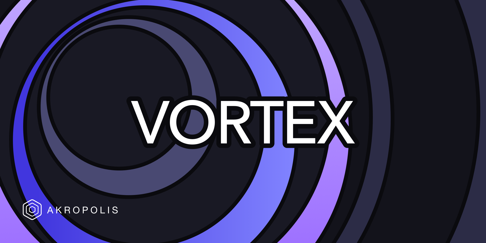

# Vortex
Vortex is an on-chain basis trading strategy that aims to generate long-term, sustainable and rewarding yields while remaining market-neutral.

## Advantages of using Vortex

* **Market Neutrality** - Vortex allows users to generate yield without being exposed to directional price risk. Regardless of whether it’s a bull, bear or crab season, Vortex should generate sustainable yields.
* **Rewarding Yields** - Vortex’s underlying strategy has proven to be profitable across all market conditions and has historically outperformed many other market-neutral strategies and higher-risk yield farms.
* **Single Asset** - Vortex only requires users to deposit a single asset - USDC. This makes Vortex an effective alternative to lending or farming with stablecoins.
* **Low Maintenance** - Vortex is a passive strategy for our users, but actively managed by our strategists for maintenance and risk management. The returns generated by Vortex are also periodically compounded, further enhancing yield.
* **Ecosystem Benefits** - Vortex provides liquidity that is crucial for decentralized derivative exchanges that offer perpetual contracts to function.

For more on this please see [Vortex Documentation](https://akropolis.gitbook.io/akropolis/products/vortex/).

## Development

### Clone repository

- clone using HTTPS
  ```bash
  git clone https://github.com/akropolisio/vortex.git
  ```
- or SSH
  ```bash
  git clone git@github.com:akropolisio/vortex.git
  ```
- change directory to vortex
  ```bash
  cd vortex
  ```

### Setup environment

#### VSCode + Docker (recommended)

- install [Docker](https://docs.docker.com/get-docker/)
- install [VSCode](https://code.visualstudio.com/)
- install [Remote - Containers](https://marketplace.visualstudio.com/items?itemName=ms-vscode-remote.remote-containers) VSCode extension
- open cloned Vortex repository in VSCode
- click F1 and run `>Remote-Containers: Reopen in Container`
- wait until all dependencies are installed (you will see the message "Done. Press any key to close the terminal." in the terminal `Configuring`)

#### Manual

* you will need Python 3.8 and Node.js >=14.x
* install ganache-cli
  ```bash
  npm install -g ganache-cli
  ```
* install python requirements
  ```bash
  pip install -r requirements.txt
  ```
* install hardhat (brownie compatible version of hardhat in order to use arbitrum properly)
  ```bash
  sh ./arb-deploy.sh
  ```
* install contracts dependencies
  ```bash
  sh ./security/clone-packages.sh
  ```
* update brownie networks
  ```bash
  brownie networks import network-config.yaml true
  ```

### Setup .env

- run `cp .example.env .env`
- insert keys into `.env`

### Run tests

* to run the arbitrum tests, "-s" will provide print outputs which this test suite uses to visualise yield:
  ```bash
  brownie test -s
  ```
* to run the bsc tests
  ```bash
  brownie test -s --network=bsc-main-fork
  ```
